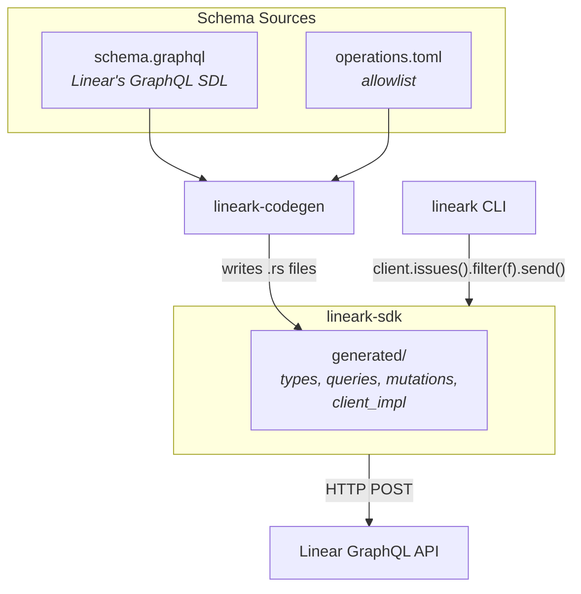
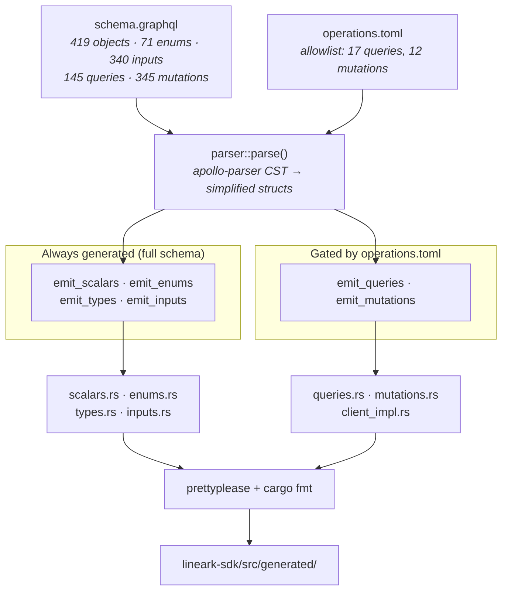
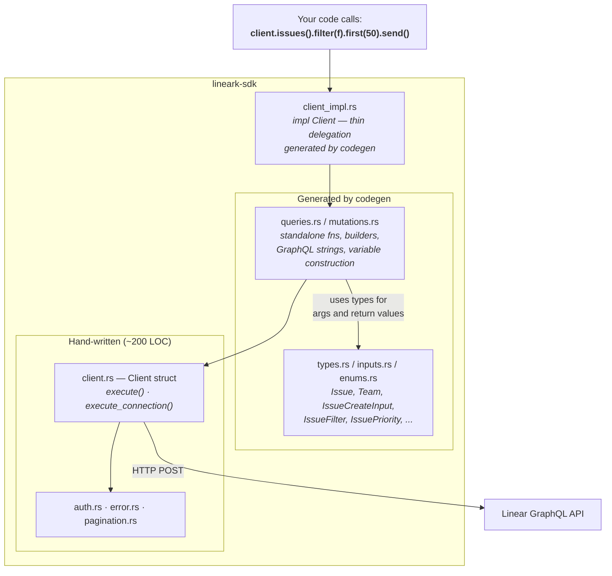
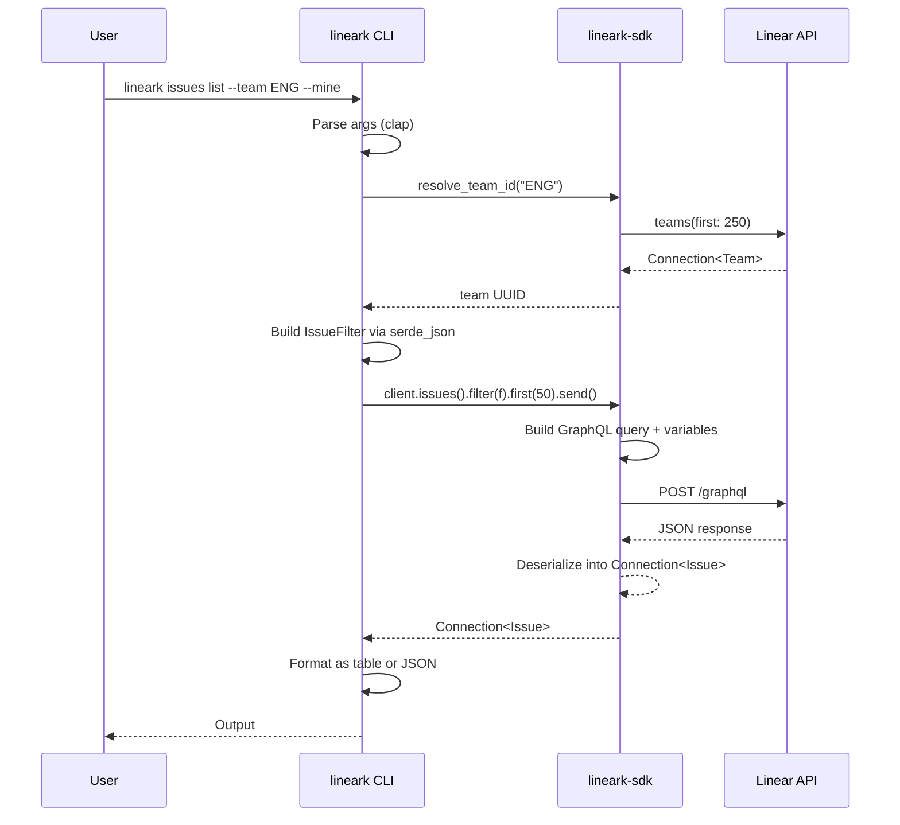

# lineark / lineark-sdk

Unofficial [Linear](https://linear.app) CLI and Rust SDK — for humans and LLMs.

[](https://github.com/flipbit03/lineark/actions/workflows/ci.yml)
[](https://crates.io/crates/lineark)
[](https://crates.io/crates/lineark-sdk)
[](https://crates.io/crates/lineark)
[](https://crates.io/crates/lineark-sdk)
[](https://docs.rs/lineark-sdk)
[](LICENSE)

## Getting Started

Create a [Linear API token](https://linear.app/settings/account/security) (Settings > Security & Access > Personal API Keys) and save it:

```sh
echo "lin_api_..." > ~/.linear_api_token
```

Or use an environment variable:

```sh
export LINEAR_API_TOKEN="lin_api_..."
```

Then proceed to install the [CLI](#cli-lineark) or [SDK](#sdk-lineark-sdk).

## CLI: `lineark`

### Installation

#### Pre-built binary (static binary, no Rust toolchain needed)

```sh
curl -fsSL https://raw.githubusercontent.com/flipbit03/lineark/main/install.sh | sh
```

The script automatically selects between `linux/x86_64`, `linux/aarch64` or `macos/aarch64`, and running it again will update to the latest version. You can also bypass the installer and download the binary for your system from the [latest release](https://github.com/flipbit03/lineark/releases/latest).

#### Via cargo

```sh
cargo install lineark
```

### Usage

| Command | Description |
|---------|-------------|
| `lineark whoami` | Show authenticated user |
| `lineark teams list` | List all teams |
| `lineark users list [--active]` | List users |
| `lineark projects list` | List all projects |
| `lineark labels list` | List issue labels |
| `lineark cycles list [--limit N] [--team KEY]`<br>`[--active]`<br>`[--around-active N]` | List cycles<br>Only the active cycle<br>Active ± N neighbors |
| `lineark cycles read <ID> [--team KEY]` | Read cycle (UUID, name, or number) |
| `lineark issues list [--limit N] [--team KEY]`<br>`[--mine]`<br>`[--show-done]` | Active issues, newest first<br>Only issues assigned to me<br>Include done/canceled issues |
| `lineark issues read <IDENTIFIER>` | Full issue detail (e.g., E-929) |
| `lineark issues search <QUERY> [--limit N]`<br>`[--show-done]` | Full-text search<br>Include done/canceled results |
| `lineark issues create <TITLE> --team KEY`<br>`[--priority 0-4] [--assignee ID]`<br>`[--labels ID,...] [--description TEXT]`<br>`[--status NAME] [--parent ID]` | Create an issue<br>0=none 1=urgent 2=high 3=medium 4=low<br>Comma-separated label UUIDs<br>Status resolved against team states |
| `lineark issues update <IDENTIFIER>`<br>`[--status NAME] [--priority 0-4]`<br>`[--assignee ID] [--parent ID]`<br>`[--labels ID,...] [--label-by adding\|replacing\|removing]`<br>`[--clear-labels] [--title TEXT] [--description TEXT]` | Update an issue<br>Status resolved against team states<br>User UUID or issue identifier |
| `lineark issues archive <IDENTIFIER>` | Archive an issue |
| `lineark issues unarchive <IDENTIFIER>` | Unarchive a previously archived issue |
| `lineark issues delete <IDENTIFIER>`<br>`[--permanently]` | Delete (trash) an issue<br>Permanently delete instead of trashing |
| `lineark comments create <ISSUE-ID> --body TEXT` | Comment on an issue |
| `lineark documents list [--limit N]` | List documents |
| `lineark documents read <ID>` | Read document (includes content) |
| `lineark documents create --title TEXT`<br>`[--content TEXT] [--project ID] [--issue ID]` | Create a document |
| `lineark documents update <ID>`<br>`[--title TEXT] [--content TEXT]` | Update a document |
| `lineark documents delete <ID>` | Delete (trash) a document |
| `lineark embeds upload <FILE> [--public]` | Upload file, returns asset URL |
| `lineark embeds download <URL>`<br>`[--output PATH] [--overwrite]` | Download a file by URL |
| `lineark usage` | Compact command reference |

Every command supports `--help` for full details.

Output auto-detects format (tables in terminal, JSON when piped) — override with `--format {human,json}`.

### LLM / AI Agent Setup

Add this to your LLM's context (e.g. `CLAUDE.md`, `.cursorrules`, system prompt):

```
We track our tickets and projects in Linear (https://linear.app), a project management tool.
We use the `lineark` CLI tool for communicating with Linear. Use your Bash tool to call the
`lineark` executable. Run `lineark usage` to see usage information.
```

`lineark usage` gives your agent a complete command reference in under 1,000 tokens.

## SDK: `lineark-sdk`

Use `lineark-sdk` as a library in your own Rust projects:

```sh
cargo add lineark-sdk
```

```rust
use lineark_sdk::Client;

#[tokio::main]
async fn main() -> Result<(), Box<dyn std::error::Error>> {
    // auto() tries all token methods (env var, ~/.linear_api_token file)
    let client = Client::auto()?;

    let me = client.whoami().await?;
    println!("{:?}", me);

    // Queries with optional args use a builder pattern:
    let teams = client.teams().first(10).include_archived(false).send().await?;
    for team in &teams.nodes {
        println!("{}: {}",
            team.key.as_deref().unwrap_or("?"),
            team.name.as_deref().unwrap_or("?"),
        );
    }

    // Search uses a required `term` arg + optional builder params:
    let results = client.search_issues("bug").first(5).send().await?;
    println!("Found {} issues", results.nodes.len());

    Ok(())
}
```

## Architecture

lineark is three crates that form a clean pipeline:

- **lineark-codegen** reads Linear API's GraphQL schema and generates typed Rust code into the SDK
- **lineark-sdk** combines a small hand-written core with the generated types, queries, and mutations into a cohesive and reusable client library
- **lineark** consumes the SDK as a normal library — zero GraphQL, just typed method calls

### The Big Picture



### Code Generation Pipeline

The codegen crate parses Linear's GraphQL schema (vendored as `schema.graphql`) using `apollo-parser`, then emits seven Rust source files into the SDK:



Types, enums, scalars, and inputs are **always fully generated** from the schema. Queries and mutations are **gated by `operations.toml`** — only explicitly listed operations get code emitted. This keeps the SDK surface incremental and intentional.

### SDK Structure

The SDK has a small hand-written core and a large generated layer:



The key trick: `Client` is defined in hand-written `client.rs`, but codegen adds methods to it via a separate `impl Client` block in `client_impl.rs`. Rust's open `impl` blocks make this seamless — consumers see one unified `Client` type with both hand-written and generated methods.

### How the CLI Plugs In

The CLI is a pure consumer of the SDK. It has **zero GraphQL strings** and **zero custom response structs**:



Each CLI command module follows the same pattern:

1. Parse command-line args
2. Resolve human-friendly identifiers to UUIDs (team keys, issue identifiers)
3. Call SDK builder methods
4. Format output (tables for terminal, JSON when piped)

## License

MIT
