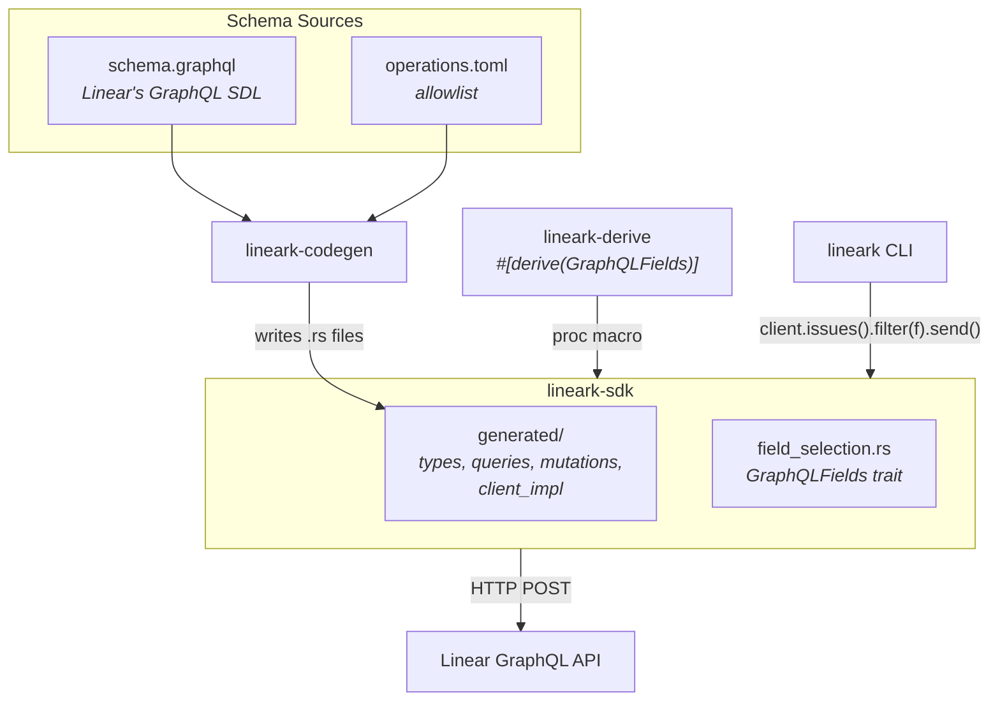
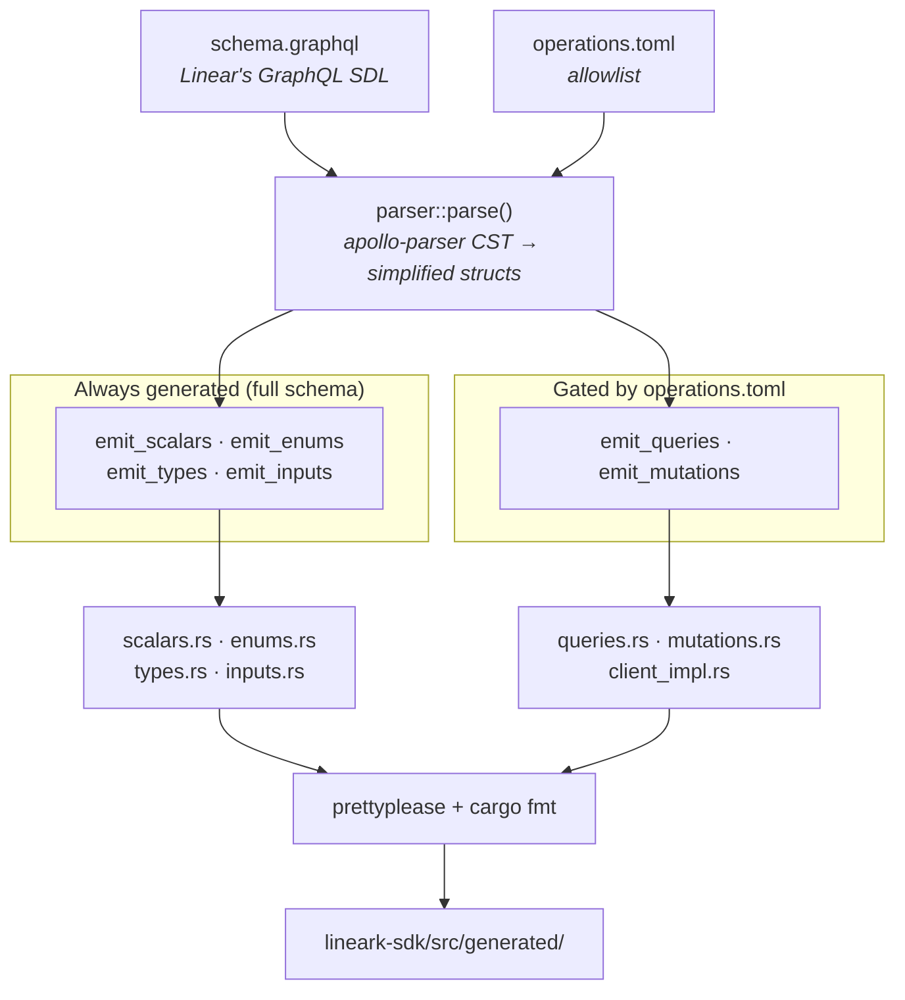
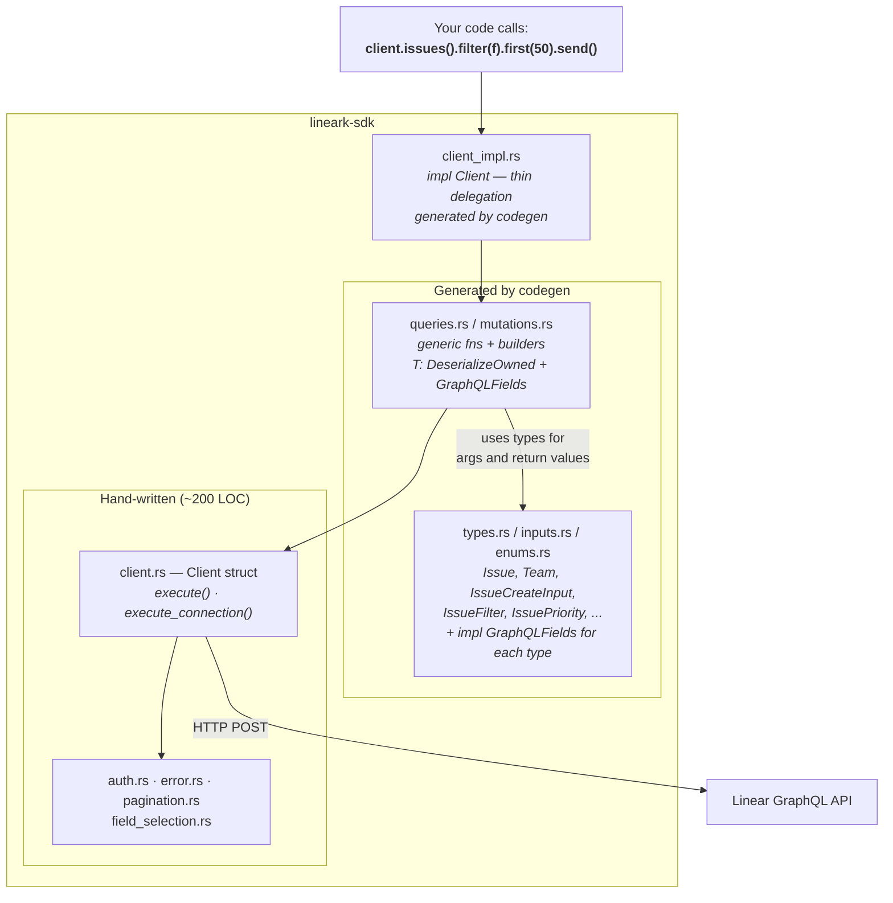
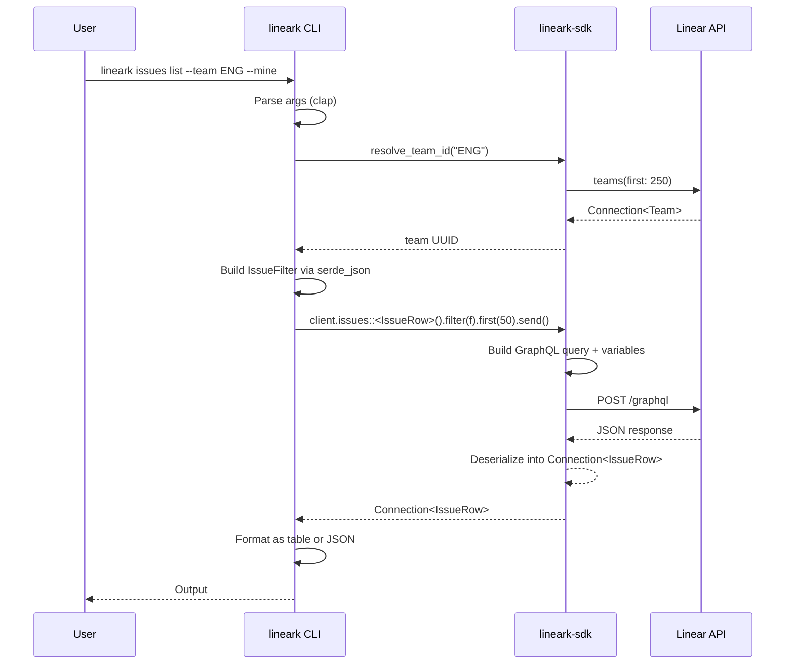

# Architecture

lineark is four crates that form a clean pipeline:

- **lineark-codegen** reads Linear API's GraphQL schema and generates typed Rust code into the SDK
- **lineark-sdk** combines a small hand-written core with the generated types, queries, and mutations into a cohesive and reusable client library
- **lineark-derive** provides `#[derive(GraphQLFields)]` — a proc macro for custom lean types with zero overfetching (re-exported by `lineark-sdk`, no extra dependency needed)
- **lineark** consumes the SDK as a normal library — zero GraphQL, typed method calls with custom lean types via `#[derive(GraphQLFields)]`

## The Big Picture

## Code Generation Pipeline

The codegen crate parses Linear's GraphQL schema (vendored as `schema.graphql`) using `apollo-parser`, then emits seven Rust source files into the SDK:

Types, enums, scalars, and inputs are **always fully generated** from the schema. Queries and mutations are **gated by `operations.toml`** — only explicitly listed operations get code emitted. This keeps the SDK surface incremental and intentional.

## SDK Structure

The SDK has a small hand-written core and a large generated layer:

The key trick: `Client` is defined in hand-written `client.rs`, but codegen adds methods to it via a separate `impl Client` block in `client_impl.rs`. Rust's open `impl` blocks make this seamless — consumers see one unified `Client` type with both hand-written and generated methods.

All query/mutation methods are generic over `T: DeserializeOwned + GraphQLFields`. The generated types implement `GraphQLFields` automatically (via codegen), and consumers can define custom lean structs with `#[derive(GraphQLFields)]` to fetch only the fields they need — the derive macro is re-exported by `lineark-sdk`, so `use lineark_sdk::GraphQLFields` gives you both the trait and the macro with no extra dependency. Custom types must include `#[graphql(full_type = X)]` pointing to the corresponding generated type — this is required for the query's type constraint and also validates fields at compile time.

## How the CLI Plugs In

The CLI is a pure consumer of the SDK. It has **zero GraphQL strings** and uses custom lean types with `#[derive(GraphQLFields)]` to fetch only the fields it needs:

Each CLI command module follows the same pattern:

1. Parse command-line args
2. Resolve human-friendly names to UUIDs (teams, users, labels, projects, cycles, issues)
3. Call SDK builder methods
4. Format output (tables for terminal, JSON when piped)
